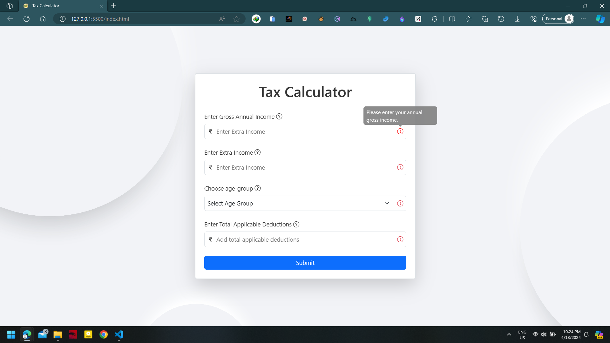
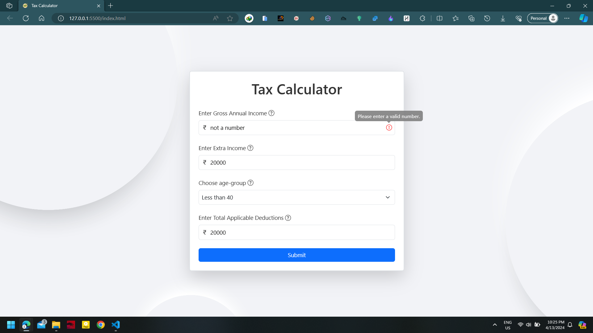
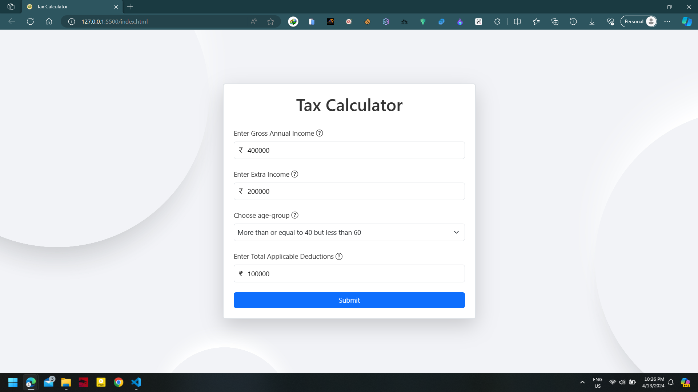

 
<h1>Tax Calculator</h1>

## Description
This is a simple tax calculator that calculates the tax based on the income and the tax slab.

## Tech Stack
1. HTML
2. CSS
3. JavaScript
4. Bootstrap
5. jQuery09m 

## How to use
1. Enter the `Gross Annual income`.
2. Enter the `Extra Income`.
3. Select your age group.
4. Click Submit.

## How to run locally
1. Clone this repository.
2. Go to the directory where you have cloned the repository.
3. Open the `index.html` file in your browser.

## Live Demo Link
[Click here to view the demo](https://tax-calculator-in.vercel.app/)

## Screenshots

### When Input field is empty

### When Input field is filled but not a with number

### When all the input fields are filled correctly

### Result

